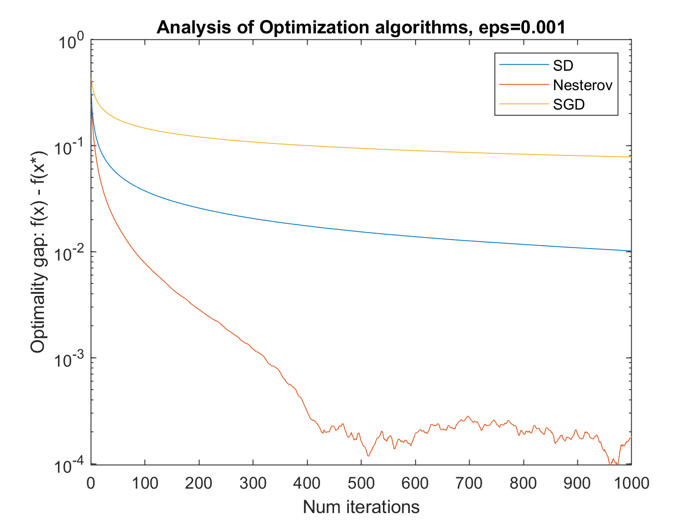

# CS726 - HW5

## Constrained Minimization

### Q1. Importance of Choosing Appropriate Geometry

#### Usage

Run the following in the current directory in a MatLab shell:

```MatLab
q1(<n>, <n_iter>)
```

where the dimension, `n = 500` and `n_iter = 2000`.

For more information, type the following:

```MatLab
help q1
```

#### Results

The below plots compare Projected Gradient Descent to Mirror Descent.

<p float="left">
	
	
</p>

### Q2. Comparing Frank-Wolfe and PGD

#### Usage

Run the following in the current directory in a MatLab shell:

```MatLab
q2(<p>, <n>, <n_iter>)
```

where the dimension, `p = 10`, `n = 200` and `n_iter = 300`.

For more information, type the following:

```MatLab
help q2
```

#### Results

The below plot compares Frank Wolfe method to Projected Gradient Descent method.


## Q3. First order Methods with Noisy Gradient Oracle

### Usage

Run the following in the current directory in a MatLab shell:

```MatLab
q3(<n>, <n_iter>, <epsilon>)
```

where the dimension, `n = 200`, `n_iter = 300` and `epsilon = 0.1, 0.001` or `0.00001`.

For more information, type the following:

```MatLab
help q3
```

### Results

The below plots generated by the script compares the various optimization algorithms for increasing noise. As we can see, SGD is most stable to the addition of the noise, but with less noise, it converges slowly.

<p float="left">
	
	
	
</p>
